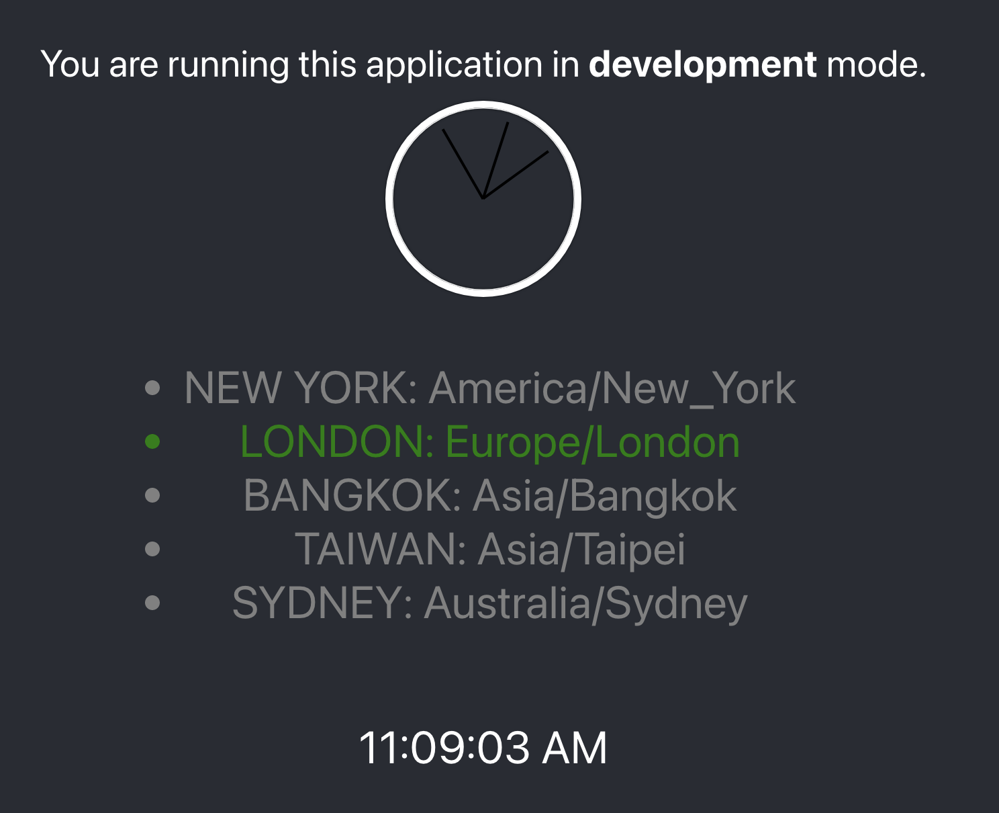
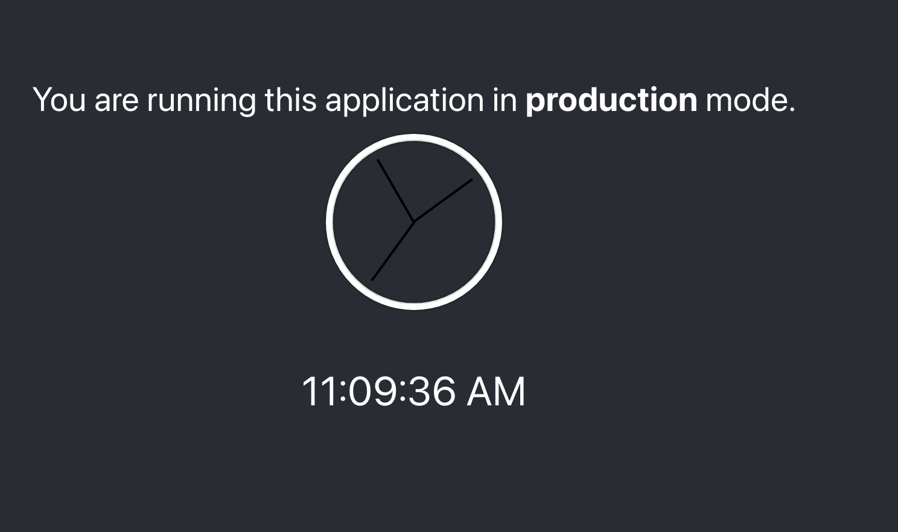

# Clock demo to show feature flagging with Launch Darkly

## Timezone feature toggled on for dev


## Timezone feature toggled off for prod



## To run development app

```console
npm install

npm start
```

## To run production app

```console
npm run-script build

npm install -g serve

serve -s build
```

## Set up LaunchDarkly

Set up a new trial

https://docs.launchdarkly.com/home/getting-started

- Add a feature flag called `showTimeZonePicker`

- Get the clientId from the Accounts->Projects page https://app.launchdarkly.com/settings/projects

- Add them to App.js here

```js
    export default withLDProvider({
        clientSideID: process.env.NODE_ENV === 'production' ? '<LD-Production-Client-side ID>' :'<LD-Test-Client-side ID>',
        user: {
            "key": "abcdefg",
            "name": "Grace Hopper",
            "email": "grace.happer@example.com"
        },
        options: { /* ... */ }
    })(App);
```

# Getting Started with Create React App

This project was bootstrapped with [Create React App](https://github.com/facebook/create-react-app).

